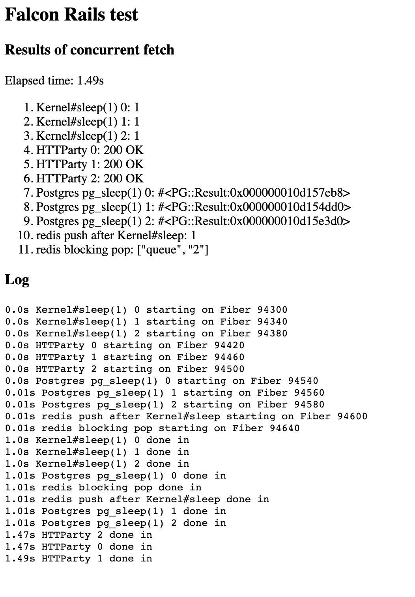

# Async Rails Test

Edge Rails (as of 2/5/2022) now has a [Fiber-safe ActiveRecord::ConnectionPool](https://github.com/rails/rails/pull/44219).

This is a simple Rails server that demonstrates how Edge Rails can be used in conjunction
with the highly concurrent, Fibers-based [Falcon web server](https://github.com/socketry/falcon).

With the Ruby 3.1 Fiber scheduler, any Ruby IO
(and any C extensions that have made the necessary changes to support the Fiber scheduler,
including the `pg` Postgres gem) can now be efficiently scheduled onto the Fiber Scheduler
in a non-blocking way, allowing these IO operations to be performed concurrently. Previous
versions of the Async gem required use of a variety of different Async-specific gems to
get this to work, but now a vast majority of common/mainstream gems work in a
Fiber-friendly concurrent manner out of the box. And with a Fiber-safe connection pool,
now ActiveRecord queries can be made concurrently with a Fiber-centric server like Falcon.

See the [application controller](./app/controllers/application_controller.rb) for
how the screenshot below is rendered:



## Requirements

The main requirements to get something like this working on your server:

1. Edge Rails (hopefully they'll have an official release soon that includes Fiber-safe connection pool)
1. Latest version of Falcon
1. Latest version of Async
1. Latest version of pg Postgres gem (with support for Ruby 3.1 Fiber Scheduler)
1. Ruby 3.1+ (which includes refinements to the Ruby Fiber Scheduler interface)

Add the following to config/application.rb:

```rb
config.active_support.isolation_level = :fiber
```

